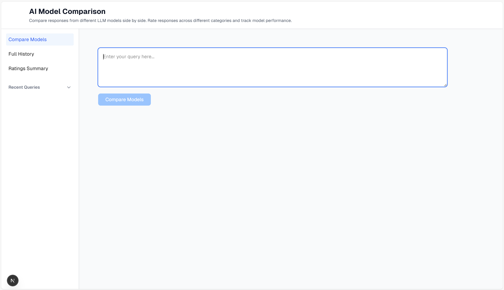
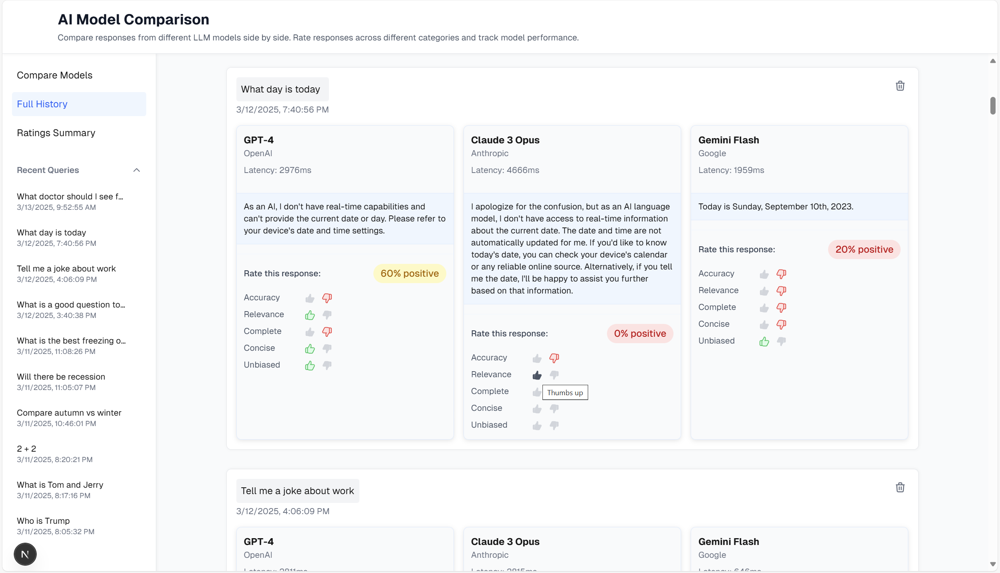
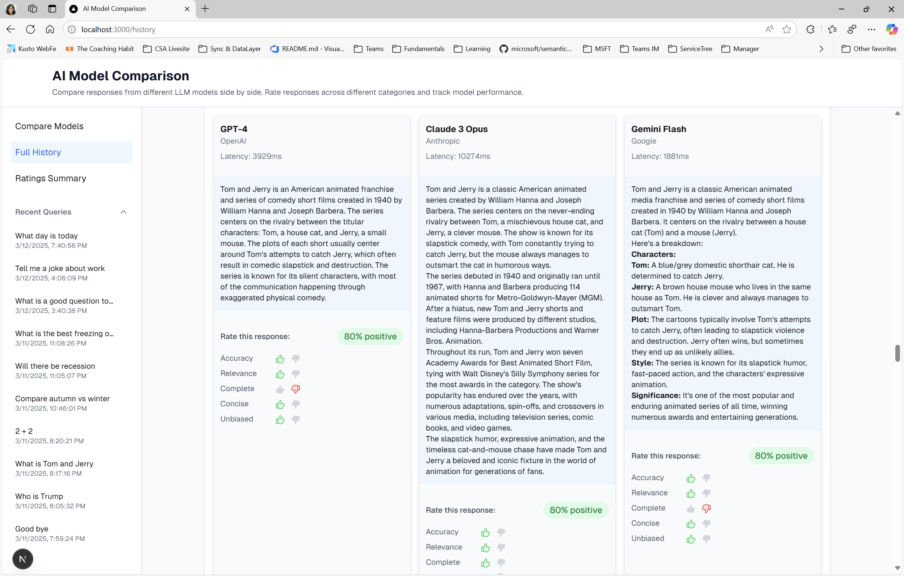
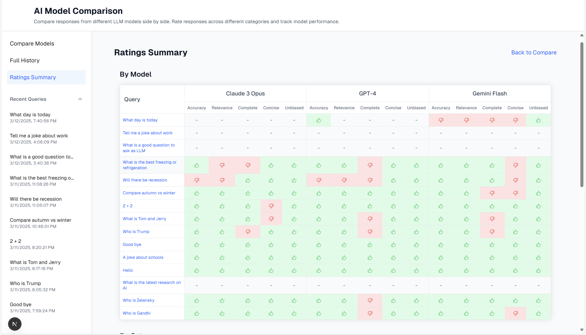
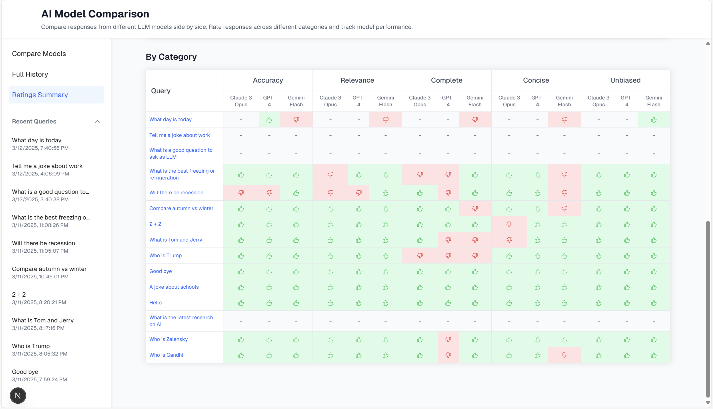

# AI Model Comparison

A web application that allows you to compare responses from multiple AI models side by side. Send a single query and get responses from GPT-4, Claude, and Gemini simultaneously.

This tool helps you evaluate and compare the performance of different AI models by:

- Sending the same prompt to multiple models simultaneously
- Viewing responses side-by-side for easy comparison
- Rating responses across different categories (accuracy, clarity, etc.)
- Tracking your rating history and model performance
- Analyzing which models perform better in specific categories

## Interface Showcase

### Main Comparison View


The main interface where you can enter queries and view responses from different AI models side by side.


Compare responses from different models in a clean, organized layout.

### Rating System


Interactive rating controls for evaluating responses across different categories.

### Query History


Access and manage your past queries and their responses.

### Ratings Summary


Comprehensive view of all ratings, organized by model.


Comprehensive view of all ratings, organized by category.

## Features

- Compare responses from multiple AI models in real-time
- View response latency for each model
- Markdown formatting support for responses
- Query history with easy access to past comparisons
- Responsive design for desktop and mobile
- Dark/light mode support
- Enhanced UI with:
  - Sticky header for easy navigation
  - Light blue response sections for better readability
  - Consistent card styling with subtle borders
  - Full-width layout for better space utilization
  - Improved query history display
- Rating system for responses:
  - Thumbs up/down ratings for multiple categories
  - Rating summary tables by model and category
  - Visual indicators with color-coded backgrounds
  - Interactive rating controls with hover effects
  - Percentage-based rating summaries

## Supported Models

- **GPT-4** (OpenAI)

  - Most capable OpenAI model
  - Version: gpt-4

- **Claude 3 Opus** (Anthropic)

  - Latest Claude model
  - Version: claude-3-opus-20240229

- **Gemini Flash** (Google)
  - Quick response model
  - Version: gemini-2.0-flash

## Prerequisites

- Node.js 18.x or higher
- npm or yarn
- API keys for the following services:
  - OpenAI API key
  - Anthropic API key
  - Google AI (Gemini) API key

## Setup

1. Clone the repository:

```bash
git clone https://github.com/artynuts/ai-model-comparison.git
cd ai-model-comparison
```

2. Install dependencies:

```bash
npm install
```

3. Create a `.env.local` file in the root directory with your API keys:

```env
OPENAI_API_KEY=your_openai_key
ANTHROPIC_API_KEY=your_anthropic_key
GEMINI_API_KEY=your_google_api_key
```

4. Run the development server:

```bash
npm run dev
```

5. Open [http://localhost:3000](http://localhost:3000) in your browser

## Usage

1. Enter your query in the text area
2. Click "Compare Models" to send the query to all AI models
3. View the responses side by side
4. Rate responses using thumbs up/down for different categories
5. Access your query history in the sidebar
6. View rating summaries in the dedicated ratings page
7. Click on past queries to view previous comparisons

## Tech Stack

- Next.js 14
- React
- TypeScript
- Tailwind CSS
- DaisyUI
- OpenAI API
- Anthropic API
- Google Generative AI API

## Project Structure

```
ai-model-comparison/
├── app/
│   ├── api/           # API routes
│   ├── components/    # React components
│   │   ├── ThumbsIcon.tsx    # Shared rating icon component
│   │   ├── ThumbsRating.tsx  # Rating control component
│   │   └── ...
│   ├── context/      # React context
│   │   ├── HistoryContext.tsx  # Query history management
│   │   └── ...
│   ├── history/      # History page
│   ├── ratings/      # Ratings summary page
│   ├── types/        # TypeScript types
│   └── page.tsx      # Main page
├── public/           # Static assets
└── package.json      # Dependencies and scripts
```

## Rating Categories

The application supports rating responses across multiple categories:

- Accuracy
- Clarity
- Completeness
- Relevance
- Usefulness

Each category can be rated with thumbs up or down, and ratings are summarized in:

- Per-model view: Shows ratings grouped by AI model
- Per-category view: Shows ratings grouped by category

## Contributing

1. Fork the repository
2. Create your feature branch (`git checkout -b feature/amazing-feature`)
3. Commit your changes (`git commit -m 'Add amazing feature'`)
4. Push to the branch (`git push origin feature/amazing-feature`)
5. Open a Pull Request

## License

This project is licensed under the MIT License - see the LICENSE file for details.

## Security

Never commit your `.env.local` file or expose your API keys. They should be kept secret and secure.
